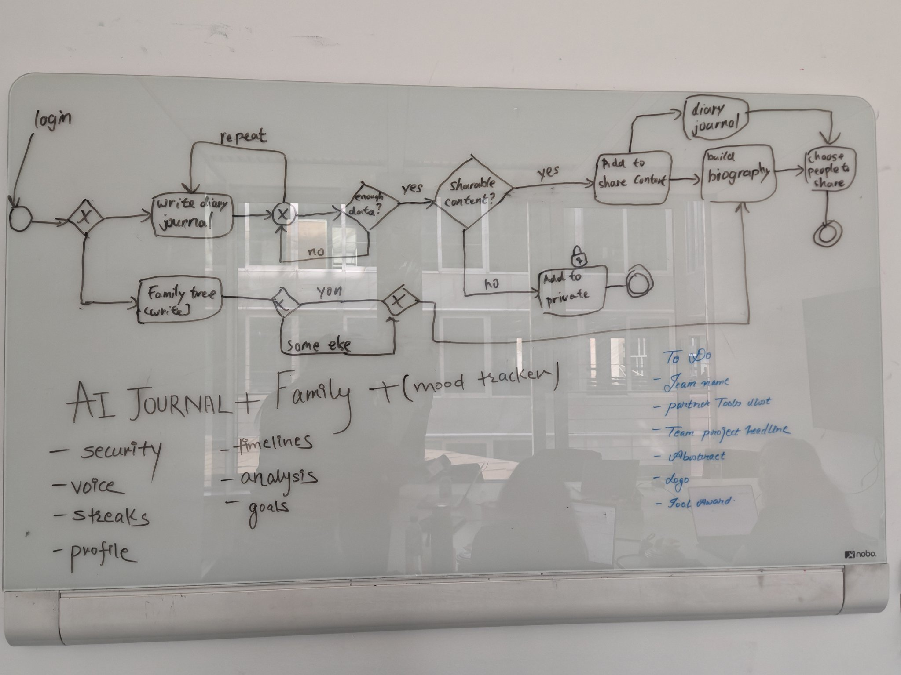
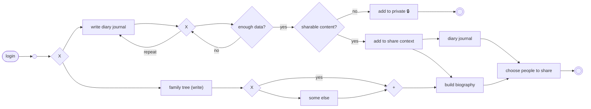

# Whiteboard Plan — AI Journal + Family (+ Mood Tracker)

> **Source:** team whiteboard session, 2026-09-12
> **Status:** agreed plan — this is the shape of the product we are building
> **Relationship to other docs:** this is the short version. The long-form
> specification of the same flow lives in
> [`family_memory_ai_detailed_plan.md`](./family_memory_ai_detailed_plan.md); the
> diagram alone lives in [`ai-journal-flow.mermaid`](./ai-journal-flow.mermaid).

---

## 1. One-line summary

**AI Journal + Family + (mood tracker)** — a user journals, the system turns
entries into structured memories, the user decides what stays private and what
enters a share context, and shared material feeds a diary, a biography, and a
family tree.

---

## 2. The flow

### Step by step

1. **Login.** Entry point for every session.
2. **Choose a branch.** The user either journals or works on the family tree.
3. **Journal branch — write diary journal.** The user writes (or speaks) an
   entry. The loop repeats: the assistant asks follow-ups and the user keeps
   adding until there is something worth keeping.
4. **"Enough data?"** If the entry is too thin to produce a memory, go back into
   the writing loop. If there is enough, move on to the privacy decision.
5. **"Sharable content?"** The decisive fork.
   - **No →** the content goes to **private** storage (🔒) and the flow ends
     there. Nothing leaves the user's own space.
   - **Yes →** the content is **added to the share context**.
6. **Share context fans out** into the **diary journal** and the **build
   biography** step.
7. **Choose people to share.** Sharing is explicit and per-person. This is the
   last step before the flow ends.
8. **Family tree branch — family tree (write).** The user records a person.
   Either the person is already known (**yes**) or it is **someone else** — a
   new person, who may have no account. Both paths merge (**+**) and feed into
   **build biography**.

### Rules the diagram encodes

- Private is the default resting state: the "no" path terminates, it does not
  leak into sharing.
- Nothing is shared without the user passing through *both* "sharable content?"
  and "choose people to share".
- The biography is assembled from two sources — journal share context and the
  family tree — not from journal entries alone.
- The journal loop is allowed to repeat indefinitely; "enough data?" is a
  readiness check, not a gate the user can fail.

---

## 3. Feature list

| Feature | What it means |
| --- | --- |
| **Security** | Private-by-default storage, explicit per-person sharing, access checks on every read. |
| **Voice** | Speak an entry instead of typing it; transcript becomes the journal entry. |
| **Streaks** | Journaling-habit streak to bring the user back daily. |
| **Profile** | The user's own person record — the root of their biography and family tree. |
| **Timelines** | Memories ordered in time, per person and per family. |
| **Analysis** | Patterns across entries: themes, people, recurring topics. |
| **Goals** | User-set intentions the journal can track against. |
| **Mood tracker** | Mood captured alongside entries; feeds analysis and timelines. Bracketed on the board — a strong candidate, not yet committed. |

---

## 4. Team to-do

- [ ] Team name
- [ ] Partner tools slot
- [ ] Team project headline
- [ ] Abstract
- [ ] Logo
- [ ] Tool award

---

## 5. Transcription notes

- "Mood tracker" is written in parentheses on the board; treated here as a
  proposed rather than settled feature.
- The `X` and `+` diamonds are unlabeled gateways: `X` is an exclusive choice
  (take one path), `+` is a merge (both paths continue into the same step).
- "Partner tools slot" and "Tool award" are transcribed as written; if the
  intent behind either differs, correct it here.
